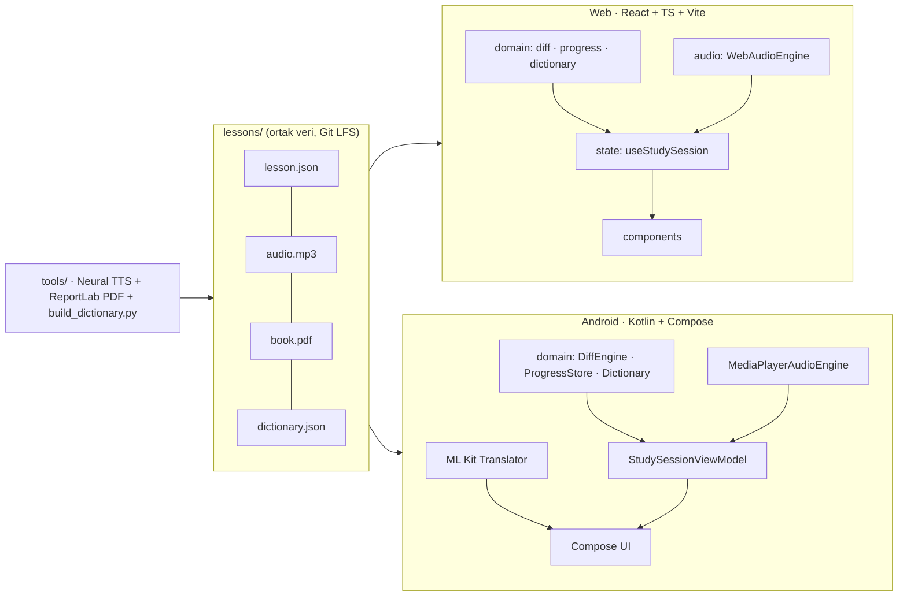

# DictaLearn

Açık kaynak, klavye ve ses odaklı İngilizce **dikte, shadowing ve çeviri** çalışma aracı.
Her cümleyi önce yalnızca **duyarsın**, sonra **yazarsın**, farkları kelime kelime **görürsün**,
düzeltir ve **sesli tekrar** edersin.

> Dinle → Yaz → Karşılaştır / Düzelt → Çeviri + Shadowing → Sonraki cümle


| Düzeltme | Shadowing + kelime kartı |
|---|---|
|  |  |

## Özellikler

- **36 kademeli klasik** (A2: 25 kitap × 300 cümle, B1: 11 kitap × 500 cümle), her biri için
  stüdyo kalitesinde nöral seslendirme (MP3), çift sütunlu PDF kitap ve `lesson.json`.
- **Kopya korumalı dikte:** cümle metni, cevap gönderilene kadar DOM'da / UI ağacında hiç bulunmaz.
- **Kelime düzeyinde diff:** doğru, yanlış (üstü çizili → altı çizili), eksik (kesikli kutu),
  fazla (üstü çizili). Renk körleri için biçimle de ayrışır.
- **İki çalışma modu:** cümle cümle veya kelime kelime (harf ipucu, kelime telaffuzu).
- **Kaldığın yerden devam:** her kitabın ilerlemesi cihazda saklanır.
- **Çevrimdışı sözlük ve kelime kartı:** açılan cümledeki herhangi bir kelimeye dokun → Türkçe
  anlam (14.000+ madde, çekim ekleri ve deyimler tanınır), telaffuz, "bilmiyorum" ile deftere ekleme.
  Android'de ayrıca **ML Kit ile cihaz içi cümle çevirisi**.
- **Hata defteri:** yanlış yazılan ve bilinmeyen kelimeler, anlamlarıyla birlikte.
- **PDF okuyucu:** web'de geniş ekranda yan panel (split view), Android'de uygulama içi okuyucu;
  web'de kendi PDF'ini ekleyebilirsin (tarayıcıda saklanır).
- **Ders oluşturucu:** kendi ses + SRT/VTT altyazı dosyalarından ders üret, `.zip` olarak paylaş.
- Hesap, sunucu, telemetri yok. Her şey cihazda çalışır.

## Klavye kısayolları (web)

| Kısayol | Eylem |
|---|---|
| `Enter` | Kontrol et · düzeltmeyi gönder · sonraki cümle |
| `Ctrl+Enter` | Cevabı göster · düzeltmeyi atla · (kelime modu) kelimeyi atla |
| `Ctrl+R` | Cümleyi baştan dinle |
| `Ctrl+Space` | Oynat / duraklat |
| `Ctrl+T` | Çeviriyi aç / kapa |
| `Ctrl+M` | Cümle / kelime modu |
| `Ctrl+1` `Ctrl+2` `Ctrl+3` | Hız 0.75x · 1x · 1.25x |
| `PageUp` `PageDown` | Önceki / sonraki cümle |
| `F1` | Kısayol penceresi |

Bir metin alanı odaktayken tek tuş kısayolları devre dışıdır; `Ctrl` kısayolları her zaman çalışır.

## Mimari



- `domain/` katmanları her iki platformda da UI ve platform bağımlılığı içermez; testler önce yazılır (TDD).
- Zaman değerleri her yerde tamsayı milisaniyedir (`start_ms`, `end_ms`).

## Kurulum

Ders ses ve PDF dosyaları **Git LFS** ile saklanır:

```bash
git lfs install
git clone <repo-url>
cd <repo>
git lfs pull
```

### Web (`Web/`)

```bash
npm install
npm run dev        # http://localhost:5173
npm test           # Vitest
npm run lint
npm run build      # dist/ (WAV ve .md dosyaları otomatik çıkarılır)
```

GitHub Pages için `VITE_BASE=/<repo-adı>/ npm run build`. `.github/workflows/deploy-pages.yml`
bunu otomatik yapar (Settings → Pages → Source: GitHub Actions).

### Android (`Android/`)

```bash
./gradlew testDebugUnitTest
./gradlew assembleDebug                                  # tüm kitaplar
./gradlew assembleDebug -Pdictalearn.slimAssets=true     # 2 kitap, küçük emülatörler için
./gradlew assembleRelease                                # R8 ile küçültülmüş
```

Release imzalama ortam değişkenleriyle yapılır: `DICTALEARN_KEYSTORE`, `DICTALEARN_KEYSTORE_PASSWORD`,
`DICTALEARN_KEY_ALIAS`, `DICTALEARN_KEY_PASSWORD`. `.github/workflows/android-release.yml`, `v*`
etiketi gönderildiğinde APK'yı üretip GitHub Release'e ekler.

### Uçtan uca testler

```bash
pip install playwright && python -m playwright install chromium
python tools/e2e/web_e2e.py http://localhost:5173/          # dev ya da preview sunucusu
python tools/e2e/android_e2e.py                              # adb ile bağlı cihaz/emülatör
```

### İçerik araçları (`tools/`)

```bash
python tools/build_dictionary.py   # lessons/dictionary.json + kopyaları
python tools/fix_mp3_encoding.py   # WAV olarak kaydedilmiş audio.mp3 dosyalarını gerçek MP3'e çevirir
```

`*.wav` master dosyaları repoya girmez; uygulamalar yalnızca `audio.mp3` kullanır.

## Lisans ve içerik

Kütüphanedeki metinler kamu malı eserlerin (Wilde, Doyle, Verne, Dickens, Shelley, Stoker…)
sadeleştirilmiş uyarlamalarıdır. Sözlük, projenin kendi ders içeriğinden ve elle yazılmış çekirdek
kelime listesinden üretilir. Kişisel / açık lisanslı olmayan dersler (`custom_*`) repoya eklenmez.
