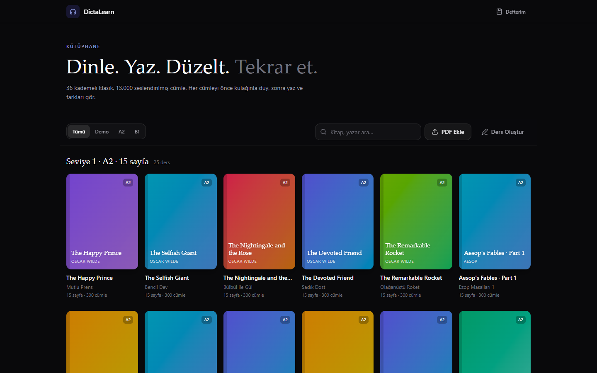
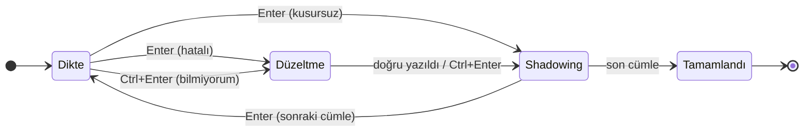
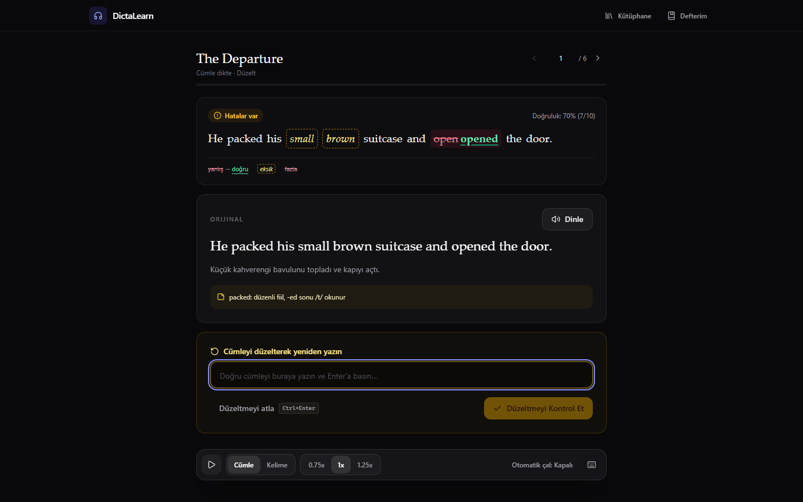
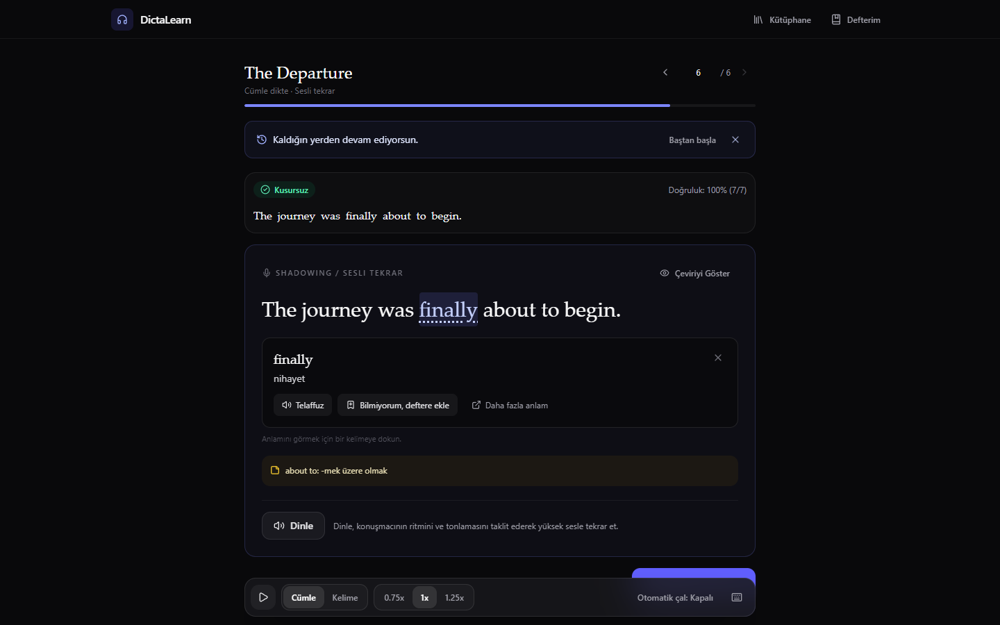
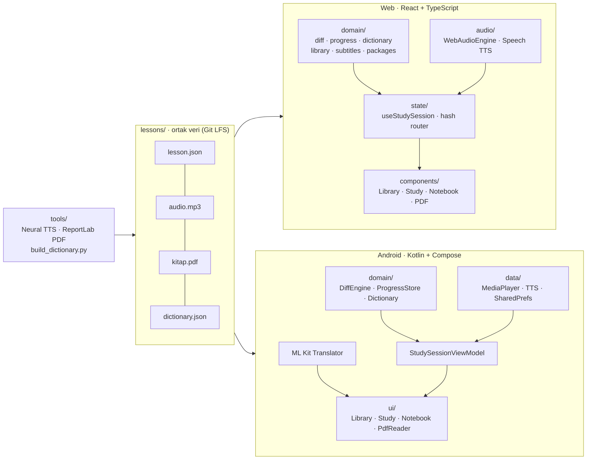

<div align="center">

# 🎧 DictaLearn

**Dinle. Yaz. Düzelt. Tekrar et.**

Klavye ve ses odaklı, açık kaynak İngilizce **dikte · shadowing · çeviri** çalışma aracı.
Web'de ve Android'de, tamamen çevrimdışı.


[](LICENSE)



</div>

---

## İçindekiler

- [Neden DictaLearn?](#neden-dictalearn)
- [Çalışma döngüsü](#çalışma-döngüsü)
- [Özellikler](#özellikler)
- [Kütüphane](#kütüphane)
- [Hızlı başlangıç](#hızlı-başlangıç)
- [Klavye kısayolları](#klavye-kısayolları)
- [Mimari](#mimari)
- [Ders formatı](#ders-formatı-lessonjson)
- [Testler](#testler)
- [Yayınlama](#yayınlama)
- [İçerik üretim hattı](#içerik-üretim-hattı)
- [Proje yapısı](#proje-yapısı)
- [Tasarım ilkeleri](#tasarım-ilkeleri)
- [Yol haritası](#yol-haritası)
- [Lisans ve içerik](#lisans-ve-içerik)

---

## Neden DictaLearn?

Pasif dinleme ("arkada podcast açık") kulağı yavaş geliştirir. DictaLearn her cümlede seni
**dört ayrı beceriyle** çalıştırır:

1. **Dinle:** Cümle yalnızca ses olarak gelir. Metin ekranda da DOM'da da yoktur.
2. **Yaz:** Duyduğunu klavyeyle yazarsın.
3. **Karşılaştır ve düzelt:** Farklar kelime kelime gösterilir, hatalı cümleyi doğrusuna bakarak yeniden yazarsın.
4. **Çevir ve seslendir:** Türkçe çeviriyi açar, cümleyi konuşmacıyı taklit ederek yüksek sesle tekrar edersin (shadowing).

Yanlış yazdığın ya da bilmediğin kelimeler **Defterim**'de birikir. Kaldığın cümle her kitap için saklanır.

## Çalışma döngüsü



| Düzeltme ekranı | Shadowing + kelime kartı |
|---|---|
|  |  |

## Özellikler

### Çalışma
- **Kopya korumalı dikte:** Orijinal metin ve çeviri, cevap gönderilene kadar sayfada hiç bulunmaz (CSS ile gizleme değil).
- **Kelime düzeyinde diff:** Levenshtein hizalaması kullanılır. Sonuçlar renkle olduğu kadar biçimle de ayrışır, renk körleri için okunabilir:
  - doğru,
  - ~~yanlış~~ → <ins>doğru</ins>,
  - eksik (kesikli kutu),
  - ~~fazla~~.
- **İki mod:**
  - *Cümle cümle:* tam dikte.
  - *Kelime kelime:* sıradaki kelimeler gizlidir. Kelimeler Boşluk tuşuyla anında kontrol edilir; harf ipucu ve kelime telaffuzu var.
    Doğru yazılan her kelimenin **altında Türkçe anlamı belirir**, böylece cümle anlamıyla birlikte adım adım tamamlanır.
    Sıradaki kelimenin anlamı ipucu olmasın diye gösterilmez; deyimler ("high above") tüm kelimeleri çözülünce görünür.
    "Anlamlar" düğmesiyle kapatılabilir.
- **Shadowing:** Cümleyi istediğin kadar tekrar dinleyebilirsin; çeviri `Ctrl+T` ile açılıp kapanır, cümle notları gösterilir.
- **Hız:** 0.75x / 1x / 1.25x. Perde korunur, ses kalınlaşıp incelmez.
- **Kaldığın yerden devam:** Her kitabın ilerlemesi cihazda saklanır. İstediğin cümleye atlayabilir ya da `PageUp`/`PageDown` ile gezinebilirsin.

### Çeviri ve kelime
- **Çevrimdışı sözlük (14.067 madde):** Açılan cümlede bir kelimeye dokunduğunda Türkçe anlamı gelir.
  - Çekimli halleri tanır: *packed → pack*, *stories → story*, *stood → stand*.
  - Deyimleri tanır: *drift apart*, *high above*.
- **Kelime kartı:** anlam, stüdyo sesiyle telaffuz ve **"Bilmiyorum, deftere ekle"**.
- **Stüdyo kelime telaffuzu:** 15.155 kelimelik çevrimdışı ses paketi; kitapları seslendiren nöral sesle okunur.
  Sistemde İngilizce ses olmasa bile anlaşılır.
- **Kelime bazlı çeviri:** Kelime modunda çözülen her kelimenin altında Türkçe anlamı belirir.
- **Android:** Google ML Kit ile **cihaz içinde** cümle çevirisi. Dil modeli bir kez indirilir, sonra internetsiz çalışır.
- **Defterim:** kaçırılan ve bilinmeyen kelimeler, sıklık ve anlamlarıyla birlikte.

### Kitaplar ve PDF
- 36 kademeli klasik. Her kitapta nöral TTS seslendirmesi, çift sütunlu (İngilizce | Türkçe) PDF ve kelime notları var.
- **Web:** Geniş ekranda PDF yan panelde açılır (split view). Kendi PDF'ini de ekleyebilirsin, tarayıcıda saklanır.
- **Kendi PDF'inden dikte dersi (web + Android):** PDF'teki İngilizce cümleler çıkarılır, Türkçe paralel metin
  ve başlıklar ayıklanır. **Taranmış (resimli) PDF'ler OCR ile okunur**: web'de Tesseract.js, Android'de
  ML Kit, ikisi de çevrimdışı. İlk 25 sayfa bitince ders açılır, kalan sayfalar arka planda okunup derse eklenir.
  Sayfalar önbelleğe alınır; aynı PDF ikinci kez taranmaz.
- **Android:** Uygulama içi PDF okuyucu.

### Kendi dersin
- **Ders oluşturucu:** Ses dosyası ve SRT/VTT altyazıdan ders üretilir. Segment zamanları, metin ve çeviri düzenlenebilir.
- Dersler `.zip` olarak dışa ve içe aktarılabilir.

## Kütüphane

| Seviye | Kitap | Cümle / kitap | Toplam | Ses |
|---|:---:|:---:|:---:|:---:|
| **A2**: 15 sayfa | 25 | 300 | 7.500 cümle | ~13 saat |
| **B1**: 25 sayfa | 11 | 500 | 5.500 cümle | ~10 saat |
| **Toplam** | **36** | | **13.000 cümle** | **~23 saat** |

<details>
<summary>Kitap listesi</summary>

**A2:** The Happy Prince · The Selfish Giant · The Nightingale and the Rose · The Devoted Friend ·
The Remarkable Rocket · Aesop's Fables (1–2) · The Little Prince · Grimm's Fairy Tales ·
Andersen: Tales of Wonder · Alice's Adventures in Wonderland · The Adventures of Pinocchio ·
The Wonderful Wizard of Oz · The Jungle Book · The Wind in the Willows · Peter Pan · Robin Hood ·
King Arthur · Gulliver's Travels · Treasure Island · Around the World in Eighty Days ·
A Christmas Carol · The Secret Garden · White Fang · The Time Machine

**B1:** A Scandal in Bohemia · The Red-Headed League · The Hound of the Baskervilles ·
The Gift of the Magi & The Last Leaf · The Call of the Wild · Frankenstein · Dracula ·
Dr. Jekyll and Mr. Hyde · The Picture of Dorian Gray · The Canterville Ghost ·
Journey to the Center of the Earth

</details>

## Hızlı başlangıç

Ses ve PDF dosyaları **Git LFS** ile saklanır. LFS olmadan klonlarsan dersler çalışmaz.

```bash
git lfs install
git clone <repo-url> dictalearn
cd dictalearn
git lfs pull
```

### Web

```bash
cd Web
npm install
npm run dev          # http://localhost:5173
```

| Komut | Açıklama |
|---|---|
| `npm test` | Vitest birim ve bileşen testleri |
| `npm run lint` | Oxlint |
| `npm run build` | Üretim derlemesi `dist/`; WAV ve `.md` dosyaları otomatik çıkarılır |
| `VITE_BASE=/repo-adi/ npm run build` | GitHub Pages alt yolu için derleme |

Gereksinim: Node.js 20.19+ (önerilen 22).

### Android

```bash
cd Android
./gradlew testDebugUnitTest
./gradlew assembleDebug                               # tüm kitaplar (~600 MB)
./gradlew assembleDebug -Pdictalearn.slimAssets=true  # 2 kitap + demo, küçük emülatörler için
./gradlew assembleRelease                             # R8 ile küçültülmüş
```

Gereksinim: JDK 17, Android SDK 36, NDK 28.2, minSdk 24.

## Klavye kısayolları

| Kısayol | Eylem | Ne zaman |
|---|---|---|
| `Enter` | Kontrol et · düzeltmeyi gönder · sonraki cümle | her durumda |
| `Ctrl+Enter` | Cevabı göster · düzeltmeyi atla · kelimeyi atla | dikte, düzeltme |
| `Ctrl+R` | Cümleyi baştan dinle | her durumda |
| `Ctrl+Space` | Oynat / duraklat | her durumda |
| `Ctrl+T` | Çeviriyi aç / kapa | düzeltme, shadowing |
| `Ctrl+M` | Cümle ↔ kelime modu | her durumda |
| `Ctrl+1` `Ctrl+2` `Ctrl+3` | Hız 0.75x · 1x · 1.25x | her durumda |
| `PageUp` `PageDown` | Önceki / sonraki cümle | her durumda |
| `Boşluk` | Kelimeyi kontrol et | kelime modu |
| `F1` | Kısayol penceresi | her durumda |

> Bir metin alanı odaktayken tek tuş kısayolları devre dışıdır. `Ctrl` kombinasyonları her zaman çalışır.

## Mimari



| Konu | Karar | Neden |
|---|---|---|
| Monorepo | `Web/` + `Android/` + ortak `lessons/` | İki platform tek ders şemasını paylaşır |
| Web sesi | `HTMLAudioElement` + konum takibi | Uzun dosyalarda PCM'e çözme yok (1 saatlik ses ≈ 700 MB olurdu); hız değişince cümle kesilmez |
| Android sesi | MediaPlayer, `SEEK_CLOSEST`, asenkron hazırlık | Milisaniye hassas başlangıç, ana thread bloke olmaz |
| Diff | Saf TS / saf Kotlin Levenshtein | Bağımlılık yok, %100 test edilebilir |
| Depolama | Web: localStorage + IndexedDB · Android: SharedPreferences | Hesap ve sunucu yok |
| Zaman birimi | Tamsayı milisaniye | Kayan nokta yuvarlama hatası olmaz |
| Yönlendirme (web) | Hash router (`#/study/<id>`) | Statik barındırmada çalışır, yenilemede ders korunur |

`domain/` katmanları UI'dan ve platformdan bağımsızdır. Bu katmanda testler koddan önce yazılır (TDD).

## Ders formatı (`lesson.json`)

```json
{
  "schema_version": 1,
  "lesson_id": "sample_ch01",
  "title": "Chapter 1: The Departure",
  "source_lang": "en",
  "target_lang": "tr",
  "audio_file": "audio.mp3",
  "attribution": { "source": "LibriVox / Public Domain", "license": "Public Domain" },
  "segments": [
    {
      "id": 1,
      "start_ms": 300,
      "end_ms": 4284,
      "text": "He packed his small brown suitcase and opened the door.",
      "translation": "Küçük kahverengi bavulunu topladı ve kapıyı açtı.",
      "notes": "packed: düzenli fiil, -ed sonu /t/ okunur"
    }
  ]
}
```

Bir ders, `lesson.json` ve `audio.mp3` dosyalarından oluşan taşınabilir bir klasördür. PDF isteğe bağlıdır. Doğrulayıcı zorunlu alanları ve zaman aralıklarının sıralı, çakışmasız olmasını kontrol eder.

## Testler

| Katman | Araç | Sayı |
|---|---|---|
| Web birim ve bileşen | Vitest + Testing Library | **156** |
| Android birim | JUnit 4 | **79** |
| Web uçtan uca | Playwright (gerçek Chromium) | **18 kontrol** (dev ve `/repo/` alt yollu prod derlemesi) |
| Android uçtan uca | adb + uiautomator (emülatör) | **13 kontrol** (debug ve R8 release APK) |

```bash
# Uçtan uca testler
pip install playwright && python -m playwright install chromium
python tools/e2e/web_e2e.py http://localhost:5173/     # dev ya da preview sunucusu
python tools/e2e/android_e2e.py                         # adb'ye bağlı cihaz/emülatör
```

Uçtan uca testlerin kontrol ettikleri:
- Klavyeyle tam ders döngüsü.
- Kopya koruması: cevap gönderilmeden cümle DOM'da yok.
- Sesin `end_ms`'de durması.
- Kelime modu ve tüm kısayollar.
- Kaldığın yerden devam.
- Kelime kartı, defter, PDF yükleme ve görüntüleme.
- ML Kit çevirisi (Android).
- Mobil taşma olmaması ve konsol hatası olmaması.

## Yayınlama

| İş akışı | Tetikleyici | Ne yapar |
|---|---|---|
| `ci.yml` | push / PR | Web: lint, test, build (Node 22). Android: birim testleri |
| `deploy-pages.yml` | `Web/**` değişikliği | `VITE_BASE=/<repo>/` ile derler, GitHub Pages'e yayınlar. LFS nesneleri önbelleğe alınır |
| `android-release.yml` | `v*` etiketi | Testler, `assembleRelease`, APK'yı GitHub Release'e ekler |

**Pages:** Settings → Pages → Source: *GitHub Actions*.

**Release imzalama:** Şu dört repository secret eklenir. Eklenmezse imzasız APK üretilir.

| Secret | Gradle'daki karşılığı |
|---|---|
| `ANDROID_KEYSTORE_BASE64` | `DICTALEARN_KEYSTORE` |
| `ANDROID_KEYSTORE_PASSWORD` | `DICTALEARN_KEYSTORE_PASSWORD` |
| `ANDROID_KEY_ALIAS` | `DICTALEARN_KEY_ALIAS` |
| `ANDROID_KEY_PASSWORD` | `DICTALEARN_KEY_PASSWORD` |

## İçerik üretim hattı

```bash
python tools/build_dictionary.py   # lessons/dictionary.json → Web ve Android kopyaları
python tools/fix_mp3_encoding.py   # WAV verisi taşıyan audio.mp3 dosyalarını 48 kbps CBR MP3'e çevirir
python tools/build_word_audio.py   # stüdyo sesli kelime paketi (lessons/word_audio, edge-tts gerekir)
```

- **Seslendirme:** Microsoft Edge Neural TTS (`en-US-ChristopherNeural`). Cümleler arasında 400 ms, sayfa sonunda 1000 ms duraklama var.
- **PDF:** ReportLab ile kapak, iki sütunlu paralel metin, sayfa başına 8 hedef kelime kutusu.
- **Sözlük:** Üç kaynaktan üretilir:
  - elle yazılmış ~500 kelimelik çekirdek liste (`tools/core_vocabulary.py`),
  - kitapların `vocab_focus` listeleri,
  - ders notlarındaki "kelime: anlam" açıklamaları.
- `*.wav` master dosyaları repoya girmez. Uygulamalar yalnızca `audio.mp3` kullanır.

## Proje yapısı

```text
.
├── Web/                      React 19 + TypeScript + Vite 8 + Tailwind CSS 4
│   ├── src/domain/           saf TS: diff, lessons, library, progress, dictionary, mistakes, subtitles
│   ├── src/audio/            WebAudioEngine, Speech TTS
│   ├── src/state/            useStudySession, hash router
│   ├── src/components/       Library, StudySession, Notebook, PdfViewer, WordLookup, LessonEditor
│   └── public/lessons/       derslerin web kopyası
├── Android/                  Kotlin + Jetpack Compose + C++ NDK
│   └── app/src/main/
│       ├── java/…/domain/    DiffEngine, LessonParser, LessonCatalog, ProgressStore, Dictionary
│       ├── java/…/data/      MediaPlayerAudioEngine, AndroidSpeechEngine, MlKitTranslator, SharedPrefs
│       ├── java/…/ui/        Library, StudySession, Notebook, PdfReader, WordLookup, LessonEditor
│       └── assets/lessons/   derslerin Android kopyası
├── lessons/                  ortak ders paketleri + dictionary.json (kaynak)
├── tools/                    içerik üretimi, sözlük, e2e testleri
├── docs/screenshots/
├── PLAN.md                   tasarım kararları ve faz listesi
├── YAPILANLAR.md             tamamlanan işlerin dökümü
└── CLAUDE.md                 geliştirme kuralları
```

## Tasarım ilkeleri

1. **Kopya koruması:** Metin ve çeviri, cevap gönderilmeden önce DOM'da veya UI ağacında yer almaz.
2. **Klavye temizliği:** Yazma alanlarında otomatik düzeltme, tamamlama ve yazım denetimi kapalıdır.
3. **Kısayol güvenliği:** Bir metin alanı odaktayken tek tuşlara kısayol bağlanmaz.
4. **Zaman:** Her yerde tamsayı milisaniye kullanılır.
5. **Erişilebilirlik:** Diff sonucu renk dışında biçimle de ayrışır.
6. **Açık içerik:** Repoya yalnızca kamu malı veya açık lisanslı içerik girer.

## Yol haritası

- [x] Faz 0–4: iskelet, web ve Android çekirdek döngüsü, düzeltme, shadowing, hata defteri, ders oluşturucu
- [x] Faz 5: 36 kitaplık multimedya kütüphanesi, kütüphane gezgini, PDF okuyucu
- [x] Faz 6: kelime kelime çalışma modu
- [x] Faz 7: çevrimdışı sözlük, kelime kartı, ML Kit çevirisi
- [x] Faz 8: Pages ve release otomasyonu, README
- [x] Faz 9: modern arayüz (kütüphane, split view, dock, mobil düzen)
- [x] Kendi PDF'inden dikte dersi, taranmış PDF'ler için OCR, kelime bazlı çeviri, stüdyo kelime telaffuzu
- [ ] Seviye 2'nin tamamlanması, Seviye 3 (B2, 35 sayfa) ve Seviye 4 (C1, 50 sayfa)
- [ ] Play Store için asset pack'lere bölünmüş Android paketi

Ayrıntılar için [PLAN.md](PLAN.md) ve [YAPILANLAR.md](YAPILANLAR.md).

## Lisans ve içerik

- **Metinler:** Kamu malı eserlerin (Wilde, Doyle, Verne, Dickens, Shelley, Stoker, London, Carroll…) sadeleştirilmiş uyarlamalarıdır.
- **Sözlük:** Projenin kendi içeriğinden ve elle yazılmış çekirdek listeden üretilmiştir.
- **Kişisel dersler:** Açık lisanslı olmayan dersler (`custom_*`) yalnızca yerelde kalır, repoya eklenmez.
- **Kod:** [MIT Lisansı](LICENSE) © 2026 Burak.
